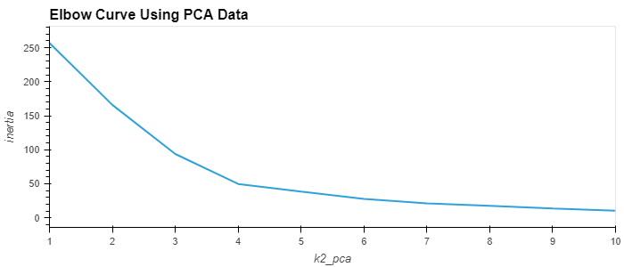

# Crypto Clustering
module 19 repo challenge

  
---
## Table of Contents

- [Background](#background)
- [Part 1: Challenge Layout](#layout)
- [Part 2: Results](#result)
- [Part 3: Conclusion](#conclusion)

---
## Background 

The crypto clustering challenge, aims to use your knowledge of Python and unsupervised learning (specifically K-means clustering) to predict if cryptocurrencies are affected by 24-hour or 7-day price changes. The project also explores the impact of dimensionality reduction using Principal Component Analysis (PCA) on clustering.

---
## Part 1: Challenge Layout 

1. Load and prepare the data.
2. Scale the data using StandardScaler.
3. Find the best value for k using the elbow method using the original scaled dataframe.
4. Cluster cryptocurrencies with K-means using the original scaled data.
5. Perform PCA to reduce the features to three principal components.
6. Find the best value for k using the PCA data.
7. Cluster cryptocurrencies with K-means using the PCA data.
8. Visualize and compare the results using hvPlot.

## Part 2: Results 

1. Scatter plot of cryptocurrency clusters based on the original data.
   

2.  Elbow curve for the original data. The best value for 'k' is 4.
   

3. Scatter plot of cryptocurrency clusters based on the PCA data.

4. Elbow curve for the PCA data. The best value for 'k' when using the PCA data is 4.

   

---
## Part 3: Conclusion    

After visually analyzing the cluster analysis results, what is the impact of using fewer features to cluster the data using K-Means?
The impact of using PCA data resulted in tighter clusters, it also resulted in more entries within cluster 0 and cluster 1 than the original analysis did.

